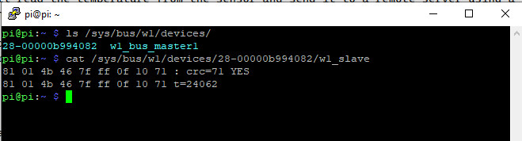

# Remote Temperature Measurement
## Introduction
This project is a simple example of how to measure temperature remotely using a Raspberry Pi 3 Model B v1.2 and a DS18B20 temperature sensor. 
The Raspberry Pi will read the temperature from the sensor and send it to a remote server using a POST request. 
The server will then store the temperature in a database and display it on a webpage.
## Requirements
- Raspberry Pi 3 Model B v1.2
- DS18B20 temperature sensor
- 4.7kΩ resistor
- Jumper wires
- MySQL database
- Apache web server
- PHP programming language

## Installation
### Raspberry Pi setup 
1. Install Pi OS on the Raspberry Pi
> - How to install: https://www.raspberrypi.com/documentation/computers/getting-started.html#installing-the-operating-system
> - Setup ssh server: https://www.raspberrypi.com/documentation/computers/remote-access.html#ssh

2. Enable 1-Wire interface which is GPIO 4 to communicate with the DS18B20 sensor.
> - How to enable 1-Wire interface and GPIO: https://pinout.xyz/pinout/1_wire
> - Add entry ***dtoverlay=w1-gpio,gpiopin=4*** to ***/boot/config.txt*** and reboot the Raspberry Pi.
> - Check if the sensor is detected by running ***ls /sys/bus/w1/devices/***.
> - Read temperature from sensor by running ***ls /sys/bus/w1/devices/***.

3. Connect the DS18B20 sensor to the Raspberry Pi
> - Datasheet: https://datasheets.maximintegrated.com/en/ds/DS18B20.pdf
> - Diagram Raspberry Pi 3 GPIO: https://www.pi4j.com/1.2/pins/model-3b-rev1.html

4. Read the temperature from the sensor