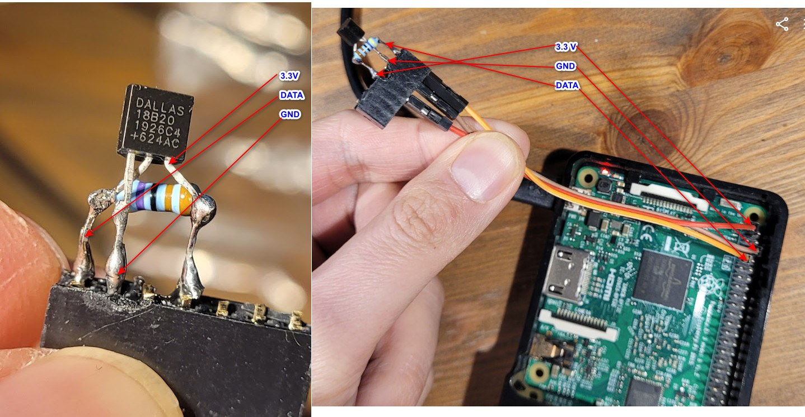

# IoT Realtime Temperature

### Demo: https://www.cc.puv.fi/~e2301482/projectEmbeddedLinux/index.html

## Introduction
This project is a simple example of how to measure temperature remotely using a Raspberry Pi 3 Model B v1.2 and a DS18B20 temperature sensor. 
The Raspberry Pi will read the temperature from the sensor and send it to a remote server using a POST request. 
The server will then store the temperature in a database and display it on a webpage.
## Requirements
- Raspberry Pi 3 Model B v1.2
- DS18B20 temperature sensor
- 4.7kΩ resistor
- Jumper wires
- MySQL database
- Apache web server
- PHP programming language



## Installation
### Raspberry Pi setup 
1. Install Pi OS on the Raspberry Pi
> - How to install: https://www.raspberrypi.com/documentation/computers/getting-started.html#installing-the-operating-system
> - Setup ssh server: https://www.raspberrypi.com/documentation/computers/remote-access.html#ssh

2. Enable 1-Wire interface which is GPIO 4 to communicate with the DS18B20 sensor.
> - How to enable 1-Wire interface and GPIO: https://pinout.xyz/pinout/1_wire
> - Add entry ***dtoverlay=w1-gpio,gpiopin=4*** to ***/boot/config.txt*** and reboot the Raspberry Pi.
> - Check if the sensor is detected by running: _**ls /sys/bus/w1/devices/**_.
> - Read temperature from sensor by running _**cat /sys/bus/w1/devices/28-00000b994082/w1_slave**_.


3. Connect the DS18B20 sensor to the Raspberry Pi
> - Datasheet: https://datasheets.maximintegrated.com/en/ds/DS18B20.pdf
> - Diagram Raspberry Pi 3 GPIO: https://www.pi4j.com/1.2/pins/model-3b-rev1.html

4. Create database and table

I create MySQL database on my university cloud. You can install MySQL on your local machine and create database.

**Create table w1_devices:**

|Field	|Description		|
|-------|-------------------|
|name	|Friendly name		|
|dev_id|Device identifier	|

```sql
CREATE TABLE w1_devices
	(
	  w1_devices_id serial NOT NULL,
	  name character varying(128) NOT NULL, 
	  dev_id character varying(64) NOT NULL,
	  CONSTRAINT w1_devices_pkey PRIMARY KEY (w1_devices_id),
	  CONSTRAINT w1_devices_dev_id_key UNIQUE (dev_id)
	)
```

**Create table temperature:**

|Field	|Description		|
|-------|-------------------|
|date_insert	|Measurement time							 |
|w1_devices_id	|Row identifier from table "w1_devices"		 |
|temperature	|The value of the measured temperature		 |
|date_check		|Time of the last measurement.				 |

```sql
CREATE TABLE temperature
(
  temperature_id SERIAL NOT NULL,
  date_insert TIMESTAMP NOT NULL DEFAULT CURRENT_TIMESTAMP,
  w1_devices_id BIGINT UNSIGNED NOT NULL,  -- Match w1_devices_id type
  temperature NUMERIC(10,2),
  date_check TIMESTAMP,
  CONSTRAINT temperature_pkey PRIMARY KEY (temperature_id),
  CONSTRAINT temperature_w1_devices_id_fkey FOREIGN KEY (w1_devices_id)
      REFERENCES w1_devices (w1_devices_id)
      ON UPDATE NO ACTION ON DELETE NO ACTION
);
```

5. PHP script

> - Home page **index.html** will call script function **read_temperature.php** to reads the temperature from a text file **dev_ds18b20.txt** in webserver.
> - Text file **dev_ds18b20.txt** contains the temperature value read from the sensor, which is read by the Raspberry Pi _**cat /sys/bus/w1/devices/28-00000b994082/w1_slave**_ and auto update **dev_ds18b20.txt** on webserver every 5 second.
> - Auto update to server every 5 second by using batch file **autoRun.sh** and **updateFile.py** which running on Raspberry Pi.
> - In **read_temperature.php** function, if the temperature has changed greater than 0.5°C, it inserts the new value into the database table "temperature".
> - Else it updates the current time in the database table "temperature".
